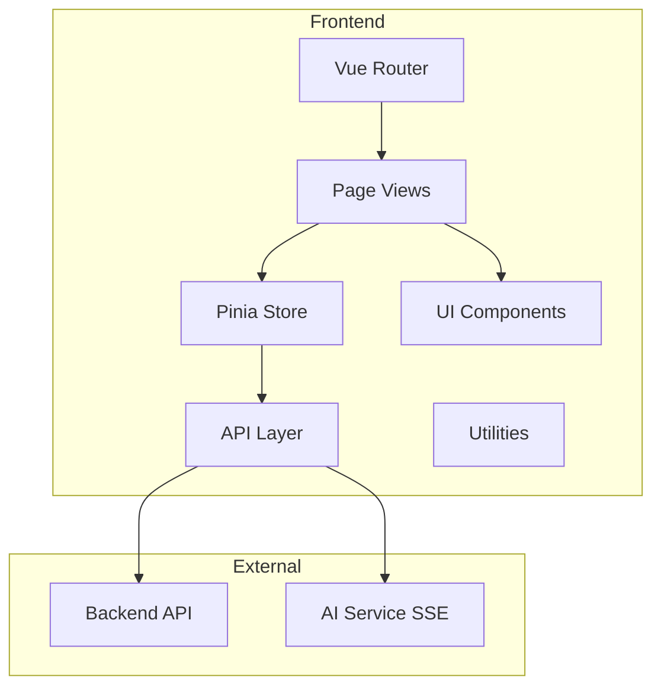

# Design Document: StructQuest Frontend UI System

## Overview

StructQuest 前端 UI 系统采用现代 AI 产品风格设计，参考 ChatGPT / Notion / Perplexity 的界面设计理念。系统基于 Vue3 + TypeScript + Vite 技术栈构建，使用 Element Plus 作为 UI 组件库，ECharts 进行数据可视化，Pinia 管理状态，Vue Router 处理路由，Axios 处理 HTTP 请求，SSE 实现流式响应。

## Architecture

### System Architecture



### Directory Structure

```
src/
├── assets/
│   ├── styles/
│   │   ├── index.scss          # 全局样式入口
│   │   ├── variables.scss      # CSS 变量定义
│   │   ├── themes.scss         # 主题样式（浅色/深色）
│   │   └── components.scss     # 公共组件样式
│   └── images/
├── components/
│   ├── common/                 # 公共组件
│   │   ├── AppHeader.vue       # 顶部导航栏
│   │   ├── AppSidebar.vue      # 左侧菜单栏
│   │   ├── Breadcrumb.vue      # 面包屑导航
│   │   ├── Card.vue            # 卡片组件
│   │   ├── Tag.vue             # 标签组件
│   │   ├── AIStatus.vue        # AI 状态组件
│   │   ├── Progress.vue        # 学习进度组件
│   │   ├── Skeleton.vue        # 骨架屏组件
│   │   ├── Modal.vue           # 弹窗组件
│   │   └── StreamMessage.vue   # 流式消息组件
│   └── layout/
│       └── MainLayout.vue      # 主布局组件
├── views/
│   ├── Login/
│   ├── Register/
│   ├── Onboarding/             # 学习人格测试
│   ├── Dashboard/              # 首页
│   ├── Map/                    # 学习地图
│   ├── Tasks/                  # 今日任务
│   ├── Resource/               # 学习资源
│   ├── Chat/                   # AI 聊天
│   ├── Analysis/               # 学习分析
│   └── Profile/                # 个人中心
├── store/
│   ├── session.js              # 会话状态
│   ├── persona.js              # 学习人格状态
│   ├── learning.js             # 学习进度状态
│   ├── chat.js                 # 聊天状态
│   └── theme.js                # 主题状态
├── router/
│   └── index.js
├── api/
│   ├── auth.js
│   ├── learning.js
│   ├── chat.js
│   └── analysis.js
├── composables/                # 组合式函数
│   ├── useSSE.js               # SSE 流式响应
│   ├── useTheme.js             # 主题切换
│   └── useAuth.js              # 认证逻辑
├── utils/
│   ├── request.js              # Axios 封装
│   ├── storage.js              # 本地存储
│   └── markdown.js             # Markdown 渲染
└── types/                      # TypeScript 类型定义
    ├── user.ts
    ├── learning.ts
    └── chat.ts
```

## Components and Interfaces

### Core Components

#### 1. AppHeader (顶部导航栏)

```typescript
interface AppHeaderProps {
  showSidebarToggle?: boolean
  showBreadcrumb?: boolean
}

interface AppHeaderEmits {
  (e: 'toggle-sidebar'): void
}
```

功能：
- 显示 Logo 和系统名称
- 全局搜索入口
- 主题切换按钮
- 用户头像和下拉菜单
- 通知图标

#### 2. AppSidebar (左侧菜单栏)

```typescript
interface MenuItem {
  id: string
  icon: string
  label: string
  path: string
  badge?: number
  children?: MenuItem[]
}

interface AppSidebarProps {
  collapsed?: boolean
  menuItems: MenuItem[]
}
```

功能：
- 折叠/展开切换
- 菜单项高亮
- 徽章显示（未读消息数等）

#### 3. Card (卡片组件)

```typescript
interface CardProps {
  title?: string
  subtitle?: string
  shadow?: 'always' | 'hover' | 'never'
  borderRadius?: 'sm' | 'md' | 'lg'
  loading?: boolean
  hoverable?: boolean
}
```

样式规范：
- 圆角：12px（sm）、16px（md）、20px（lg）
- 阴影：柔和阴影，悬停时加深
- 边框：1px solid var(--border-color)

#### 4. AIStatus (AI 状态组件)

```typescript
type AIStatusType = 'thinking' | 'analyzing' | 'recommending' | 'idle'

interface AIStatusProps {
  status: AIStatusType
  showLabel?: boolean
}
```

功能：
- 动画效果显示当前 AI 状态
- 状态文字提示

#### 5. StreamMessage (流式消息组件)

```typescript
interface StreamMessageProps {
  content: string
  isStreaming: boolean
  showCursor?: boolean
}
```

功能：
- 支持 Markdown 渲染
- 代码语法高亮
- 打字机光标效果

#### 6. Skeleton (骨架屏组件)

```typescript
interface SkeletonProps {
  rows?: number
  animated?: boolean
  variant?: 'text' | 'card' | 'list' | 'image'
}
```

### Page Components

#### Login Page

布局：左右分栏
- 左侧：品牌介绍区（深色背景 #10A37F）
- 右侧：登录表单区（浅色背景）

交互：
- 表单验证
- 加载状态动画
- 登录成功跳转

#### Dashboard Page

布局：三栏式
- 左侧：导航栏
- 中间：主内容区（AI 建议、今日任务）
- 右侧：辅助面板（进度、历史记录）

#### Learning Map Page

布局：全屏技能树
- 节点：圆形/方形，不同状态不同颜色
- 连线：曲线或直线
- 支持：缩放、平移、节点点击

#### Chat Page

布局：三栏式
- 左侧：历史会话列表
- 中间：聊天窗口（消息流）
- 底部：输入区域

## Data Models

### User Model

```typescript
interface User {
  id: string
  studentId?: string
  email: string
  name: string
  avatar?: string
  hasCompletedOnboarding: boolean
  createdAt: Date
}

interface UserProfile extends User {
  personaType: string
  personaScores: {
    visual: number
    practical: number
    theoretical: number
    explorer: number
    anxious: number
  }
}
```

### Learning Model

```typescript
interface LearningNode {
  id: string
  title: string
  description: string
  type: 'chapter' | 'section' | 'topic'
  status: 'mastered' | 'learning' | 'recommended' | 'not_started'
  prerequisites: string[]
  position: { x: number; y: number }
}

interface LearningTask {
  id: string
  title: string
  description: string
  type: 'reading' | 'practice' | 'video' | 'quiz'
  priority: 'high' | 'medium' | 'low'
  estimatedTime: number // minutes
  reason: string // AI 推荐原因
  status: 'pending' | 'in_progress' | 'completed'
  nodeId: string
}

interface LearningResource {
  id: string
  title: string
  type: 'document' | 'diagram' | 'mindmap' | 'exercise' | 'code' | 'video'
  difficulty: 'easy' | 'medium' | 'hard'
  content: string
  aiGenerated: boolean
  reason?: string
  tags: string[]
}
```

### Chat Model

```typescript
interface ChatSession {
  id: string
  title: string
  createdAt: Date
  updatedAt: Date
}

interface ChatMessage {
  id: string
  sessionId: string
  role: 'user' | 'assistant'
  content: string
  createdAt: Date
  attachments?: ChatAttachment[]
}

interface ChatAttachment {
  id: string
  type: 'pdf' | 'image' | 'code'
  name: string
  url: string
  parsedContent?: string
}
```

### Analysis Model

```typescript
interface LearningStats {
  totalStudyTime: number // minutes
  weeklyTrend: { date: Date; time: number }[]
  knowledgeMastery: { topic: string; score: number }[]
  weakPoints: { topic: string; score: number; suggestion: string }[]
  heatmap: { date: Date; count: number }[]
}
```

## Error Handling

### Error Types

```typescript
enum ErrorCode {
  NETWORK_ERROR = 'NETWORK_ERROR',
  AUTH_FAILED = 'AUTH_FAILED',
  SESSION_EXPIRED = 'SESSION_EXPIRED',
  RESOURCE_NOT_FOUND = 'RESOURCE_NOT_FOUND',
  VALIDATION_ERROR = 'VALIDATION_ERROR',
  AI_SERVICE_ERROR = 'AI_SERVICE_ERROR',
  FILE_UPLOAD_ERROR = 'FILE_UPLOAD_ERROR'
}

interface AppError {
  code: ErrorCode
  message: string
  details?: Record<string, unknown>
}
```

### Error Handling Strategy

1. **网络错误**：显示重试按钮和错误提示
2. **认证失败**：清除本地状态，跳转登录页
3. **资源不存在**：显示 404 页面
4. **验证错误**：在表单字段下显示错误信息
5. **AI 服务错误**：显示友好提示，提供重试选项
6. **文件上传错误**：显示具体错误原因，支持重新上传

### Error Display Components

- Toast 通知：短暂提示
- 弹窗确认：重要错误需要用户确认
- 内联错误：表单验证错误
- 全屏错误页：404、500 等


## Testing Strategy

### Testing Framework

- **单元测试框架**: Vitest（Vite 原生支持，配置简单，性能优秀）
- **属性测试库**: fast-check（JavaScript/TypeScript 生态成熟的 PBT 库）
- **组件测试**: @vue/test-utils（Vue 官方测试库）

### Testing Approach

采用双重测试策略：

1. **单元测试**: 验证特定示例、边界条件和错误处理
2. **属性测试**: 验证所有输入下应成立的通用属性

### Correctness Properties

*A property is a characteristic or behavior that should hold true across all valid executions of a system-essentially, a formal statement about what the system should do. Properties serve as the bridge between human-readable specifications and machine-verifiable correctness guarantees.*

#### 登录模块

**Property 1: 登录表单验证**
*For any* 用户输入的学号/邮箱和密码组合，当输入格式无效时，系统应显示相应的错误提示信息
**Validates: Requirements 1.2**

#### 学习人格测试模块

**Property 2: 测试问题卡片展示**
*For any* 测试问题列表，每个问题应以卡片形式呈现，且卡片包含问题内容和选项
**Validates: Requirements 2.2**

**Property 3: 测试进度条更新**
*For any* 已回答的问题数量，进度条显示的百分比应与 (已答题数 / 总题数) × 100 一致
**Validates: Requirements 2.3, 2.6**

#### 首页模块

**Property 4: 问候语时间匹配**
*For any* 当前时间，问候语应根据时间段正确显示（如"早安"、"午安"、"晚安"）
**Validates: Requirements 3.1**

**Property 5: 任务优先级排序**
*For any* 任务列表，任务应按优先级从高到低排序显示（high > medium > low）
**Validates: Requirements 3.3, 5.2**

**Property 6: 历史记录时间顺序**
*For any* 最近学习记录列表，记录应按时间从新到旧排序
**Validates: Requirements 3.5**

#### 学习地图模块

**Property 7: 节点连线完整性**
*For any* 学习节点及其前置依赖，节点之间应存在连线表示依赖关系
**Validates: Requirements 4.2**

**Property 8: 节点状态视觉区分**
*For any* 学习节点，根据其状态（mastered/learning/recommended/not_started），节点应具有不同的视觉样式（颜色/边框/图标）
**Validates: Requirements 4.3**

#### 学习资源模块

**Property 9: 资源卡片必需字段**
*For any* 学习资源卡片，应包含标题、类型标签、难度等级三个必需字段
**Validates: Requirements 6.2**

**Property 10: AI 生成标记显示**
*For any* AI 生成的学习资源，资源卡片应显示 AI 生成标记
**Validates: Requirements 6.3**

**Property 11: 视频资源播放器**
*For any* 视频或动画类型的资源，应内嵌播放器组件
**Validates: Requirements 6.8**

#### AI 聊天模块

**Property 12: 代码语法高亮**
*For any* AI 响应中的代码块，应应用语法高亮样式
**Validates: Requirements 7.3**

**Property 13: Markdown 渲染正确性**
*For any* Markdown 格式的 AI 响应，渲染后的 HTML 应正确解析 Markdown 语法（标题、列表、链接、代码块等）
**Validates: Requirements 7.4**

#### 公共组件模块

**Property 14: 卡片组件圆角范围**
*For any* 卡片组件，其 border-radius 值应在 12px 到 20px 之间
**Validates: Requirements 9.4**

**Property 15: AI 状态组件状态覆盖**
*For any* AI 状态类型（thinking/analyzing/recommending/idle），AI 状态组件应正确显示对应的状态样式和文字
**Validates: Requirements 9.6**

### Unit Test Examples

以下场景适合使用单元测试验证：

1. 登录页面布局渲染（左品牌区、右表单区）
2. 登录流程跳转逻辑（已完成/未完成人格测试）
3. 游客登录功能
4. 记住登录状态功能
5. 学习人格测试引导页展示
6. 测试结果生成和展示
7. AI 建议卡片渲染
8. 学习进度组件展示
9. 任务卡片点击跳转
10. 学习地图节点点击交互
11. 缩放平移功能
12. 资源卡片展开/收藏/下载
13. 流式消息输出
14. 文件上传功能
15. 会话切换功能
16. 各类图表渲染
17. 主题切换功能
18. 骨架屏加载状态

### Property-Based Test Configuration

```typescript
// vitest.config.ts
import { defineConfig } from 'vitest/config'

export default defineConfig({
  test: {
    // 属性测试运行 100 次迭代
    property: {
      numRuns: 100
    }
  }
})
```

### Test File Organization

```
src/
├── components/
│   └── __tests__/
│       ├── Card.spec.ts          # 单元测试
│       ├── Card.property.spec.ts # 属性

## Testing Strategy

### Testing Framework

本项目使用 **Vitest** 作为主要测试框架，配合 **@vue/test-utils** 进行 Vue 组件测试，使用 **fast-check** 进行属性测试。

### Testing Approach

采用双重测试策略：

1. **单元测试 (Unit Tests)**：测试具体组件、函数和模块的行为
2. **属性测试 (Property-Based Tests)**：验证系统在各种输入下的不变量和正确性

### Test Organization

```
src/
├── components/
│   └── __tests__/
│       ├── Card.test.ts
│       └── StreamMessage.test.ts
├── views/
│   └── __tests__/
│       ├── Login.test.ts
│       └── Dashboard.test.ts
└── utils/
    └── __tests__/
        └── validation.test.ts
```

### Unit Testing Guidelines

- 测试组件渲染和交互
- 测试边界情况和错误处理
- 测试事件触发和状态变化
- 使用描述性测试名称

### Property-Based Testing Guidelines

- 使用 **fast-check** 库
- 每个属性测试至少运行 100 次迭代
- 每个属性测试必须标注验证的需求编号
- 测试格式：`**Feature: {feature_name}, Property {number}: {property_text}**`
